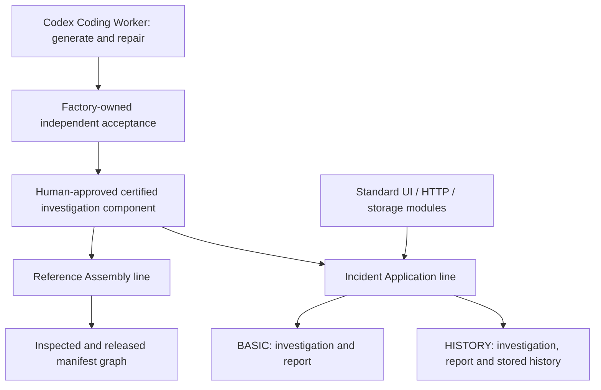

# Flower Agent Factory

[한국어 안내](README.ko.md) · [Architecture](docs/architecture.md) · [Production process](docs/production-process.md) · [Validation](docs/validation.md)

A Java-based foundation for specialized software production lines, built with
[Flower](https://github.com/flowerjvm/flower) and
[Flower Action Runtime](https://github.com/flowerjvm/flower-action-runtime).

The Factory accepts a production order, creates or assembles a candidate, independently
verifies it, binds human approval to the exact product, and ships it with its bill of
materials and provenance. A product line owns its domain requirements, blueprint,
module catalog, verification criteria, and release contract.

The project demonstrates both AI-assisted component production and deterministic
application assembly. It is an experimental implementation, with explicit contracts
and bounded demonstrations rather than a universal application generator.

## Implemented product lines

| Line | Product | Production method |
| --- | --- | --- |
| `agent-pack` | Certified maintenance investigation component | Codex Coding Worker design, generation, repair, independent acceptance, exact approval, certification |
| `reference-assembly` | Content-addressed reference manifest graph | Assemble an unchanged certified component, independently inspect, separately approve and release |
| `incident-application` | Runnable BASIC/HISTORY incident investigation applications | Select existing runtime modules, compile with the same certified component, verify the whole application, approve and ship |



The Coding Worker produced and repaired the investigation core in the demonstration.
The application's standard HTTP, UI, and history modules were developed as production
line inputs. The two application orders used `deterministic-module-assembly`; neither
order invoked a new Coding Worker. The included investigation behavior is rule-based.

## Build and verify

Requirements: **Java 21**, **Node.js 20 or newer on PATH**, and access to public Maven
dependencies. Some Java contract tests launch a fake Node worker, so Node is required
even for the default Maven build. No API key, ChatGPT login, production database, or
Docker engine is needed for the default unit checks.

```bash
git clone https://github.com/flowerjvm/flower-agent-factory.git
cd flower-agent-factory
./mvnw -B -ntp verify
```

On Windows PowerShell:

```powershell
.\mvnw.cmd -B -ntp verify
```

The reactor runs the Java unit tests and configured Flower Check. To verify the Node
bridge and local helper contracts:

```bash
cd codex-worker-runner
npm ci --ignore-scripts
npm test
cd ..
node --test tools/test/codex-worker-local.test.mjs tools/test/codex-windows-sandbox-setup.test.mjs
```

These commands exercise test fixtures. Actual production requires explicit database,
artifact storage, equipment, authentication, and isolation configuration; see
[local setup](docs/local-setup.md). Native database and sandbox profiles have additional
requirements and are separate from the default checks.

## Project structure

| Path | Responsibility |
| --- | --- |
| `factory-contracts` | Shared identifiers, references, and contracts |
| `factory-application` | Domain records, product-line rules, workflows, and ports |
| `factory-infrastructure` | JDBC persistence, artifact adapters, Codex bridge, Docker build and verification |
| `factory-builder-host` | Spring Boot host, configuration, dispatch and recovery wiring |
| `codex-worker-runner` | Pinned Codex SDK process bridge and its contract tests |
| `tools` | Local setup helpers, runtime module catalog, independent readback and historical consumer tools |
| `docs` | Public architecture, product contracts, setup, extension, and validation notes |

The published dependency baseline is Java 21, Flower `0.1.3`, Action Runtime `0.3.3`,
Spring Boot `3.5.16`, and Codex SDK `0.148.0`. This source snapshot preserves that
implementation baseline; publishing the repository does not upgrade its dependencies.

## Production principles

- Business records and `ActionRun` are durable truth; signals and checkpoints coordinate progress.
- Long model, build, and test work runs outside Flower worker ticks.
- Registered Actions apply validation, policy, scoped duplicate handling, approval where required, and fresh execution guards.
- Factory-owned verification is separate from a worker's success claim and self-tests.
- Reusable components are bound to exact bytes and current certification eligibility.
- Whole-product verification checks integration as well as individual components.
- Human approval is bound to the exact review subject. A changed candidate needs its own valid review.
- Version CAS, operation ownership, and reconciliation protect recovery; uncertain effects require review.

## Scope and demonstration status

The private local demonstration completed component generation and repair, component
certification, reference assembly shipment, and BASIC/HISTORY application shipment.
Its September 15, 2026 records report 1,304 Java unit checks, 43 native PostgreSQL
checks, Flower Check for four modules, and 75 consumer smoke assertions. Those dated
historical results are distinct from the public checkout's verification recorded in
[validation notes](docs/validation.md).

This repository publishes the implementation and test fixtures. Production databases,
credentials, user decisions and transcripts, raw local evidence, historical handoff
bundles, and consumer data are not included. Accordingly, `run-demo.ps1` and the
historical runtime/consumer sandbox suites need separately supplied demonstration
artifacts; cloning this repository does not supply a released app bundle or a live
component certification registry.

Factory responsibility ends at **shipment and provenance handoff**. Deployment,
environment-specific secret binding, service operations, monitoring, upgrades, and
rollback belong to a separate organization/operations layer. TOS and other domain
factories require their own product lines; they are extension directions, not products
already implemented here. See [extending product lines](docs/extending-product-lines.md).

## License

[Apache License 2.0](LICENSE). See [NOTICE](NOTICE) for attribution.
