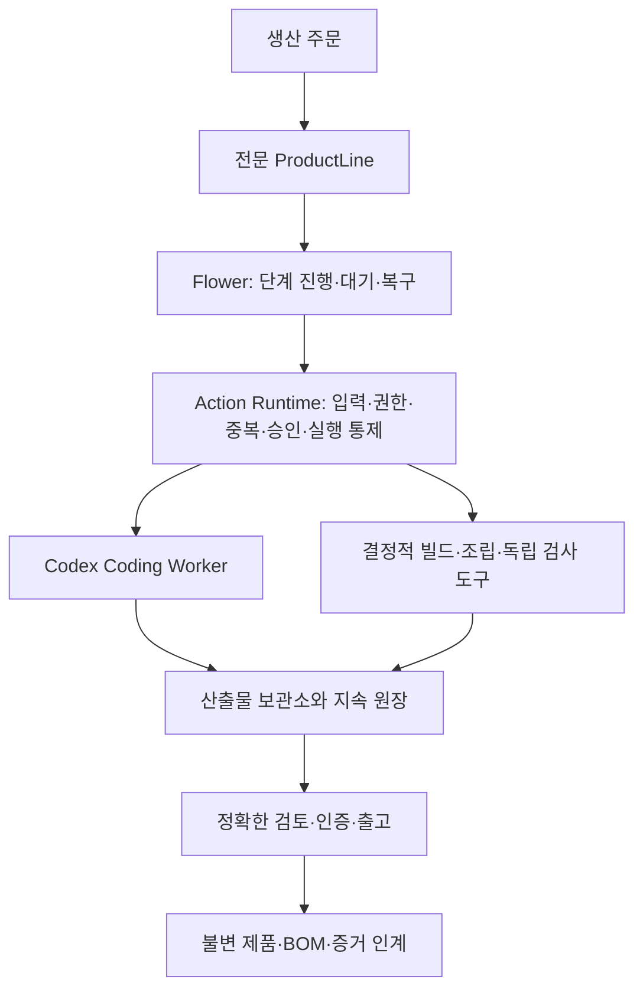

# Factory 구조

Flower Agent Factory는 전문 ProductLine을 설치하여 특정 제품군을 생산하는 기반이다.
공통 메커니즘은 주문·원장·권한·실행·증거·승인·복구를 맡고, 각 라인은 제품의 의미와
요구사항·설계·모듈·검사·출고 규격을 소유한다.

## 네 코드 모듈

| 모듈 | 책임 |
| --- | --- |
| `factory-contracts` | 공통 ID·참조·전송 계약 |
| `factory-application` | 업무 원장·상태 규칙, ProductLine, Flow와 Port |
| `factory-infrastructure` | JDBC·artifact 어댑터, Codex process bridge, Docker 설비 |
| `factory-builder-host` | Spring Boot 구성·Host 진입점·dispatch·recovery 연결 |

## 공정과 실행의 분리

Flower는 짧은 tick에서 저장된 생산 상태를 관찰하고 다음 단계를 정한다. 오래 걸리는
모델 호출·빌드·HTTP 제품 검사는 durable intent와 실행 소유권을 가진 별도 실행 경로에서
수행한다. 완료 근거를 먼저 기록하고 공정에 알린다.

Flower Worker는 런타임 실행 레인이다. Coding Worker Agent는 작업지시서에 따라 설계·코드
생성·수정을 하는 작업자다. 라인의 모든 단계에서 모델을 호출할 필요는 없다.

Action Runtime은 등록된 Action의 입력·권한·정책·중복·필요한 승인·실행 직전 guard를
통제한다. `ActionRun`의 상태와 domain record, dispatch intent는 각각의 책임을 유지하며
실제 완료를 연결해서 확인한다.

## 지속 상태와 정확한 증거

원장의 버전 CAS는 오래된 쓰기가 최신 상태를 덮는 것을 막는다. 산출물의 content hash,
BOM, 검사 결과, 승인 subject와 release manifest는 어떤 결과물이 어떤 입력과 검사를
거쳤는지 연결한다. checkpoint, signal, Future나 모델의 성공 주장은 업무 상태의 정본이 아니다.

중단 후에는 operation ID·소유자·원장·ActionRun을 대조해 재개한다. 외부 효과가 있었는지
확인할 수 없는 경계는 자동 성공이나 무조건 재실행 대신 명시적 검토로 수렴한다.
전체 외부 실행에 대한 exactly-once 보장은 주장하지 않는다.

## 확장 지점의 현재 수준

`FactoryProductLine`과 `FactoryProductLineRegistry`는 지원 라인을 명시적으로 등록하고
생성·복구 경로를 선택한다. 현재 공통 기반은 실제 라인들이 재사용하는 메커니즘이며,
임의 recipe를 동적으로 설치하는 범용 플러그인 SDK는 아니다.

TOS 등 새 라인은 [확장 문서](extending-product-lines.md)의 도메인 계약을 구현해야 한다.
기존 세 라인의 제품과 공정은 [제품 문서](product-lines.md)와 [생산 공정](production-process.md)을 따른다.
