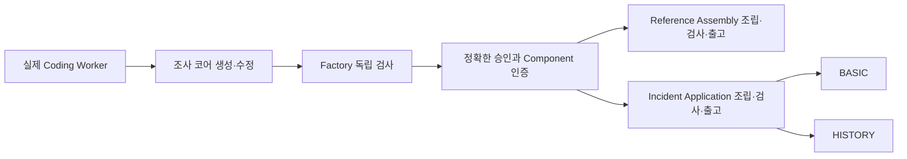

# 현재 구현된 생산라인과 제품

Flower Agent Factory는 제품 도메인에 맞는 생산라인을 구성하기 위한 기반이다. 공통 설비가 주문, 공정, 작업자 호출, 독립 검사, 승인, 인증과 출고를 추적하고, 각 생산라인이 제품의 요구사항과 조립·검사 규칙을 소유한다.

자동차 공장의 공통 설비와 차종별 생산라인을 구분하듯, 공통 Factory 코드를 재사용하면서 도메인별 규격과 부품 catalog를 추가한다. 현재 구현에는 다음 세 라인이 있다.

| 생산라인 | 입력 | 산출물 | 제품의 의미 |
| --- | --- | --- | --- |
| `agent-pack` | 명시된 Pack 요구사항과 Builder 작업지시 | 정확한 후보·검사·승인에 연결된 인증 Agent Component 참조 | 다른 라인이 소비할 수 있는 인증 부품 |
| `reference-assembly` | 현재 유효한 인증 Component와 소비 계약 | 인증 부품·계약·정책·검사 증거를 연결하는 출고된 manifest graph | 부품 조합과 출고 계보를 검증하는 제한된 조립 제품 |
| `incident-application` | 인증된 조사 코어, 앱 요구사항, 모듈 catalog | BASIC 또는 HISTORY 실행 bundle과 BOM·제품 인증·출고 증거 | 규칙 기반 장애 조사 기능을 제공하는 로컬 웹 애플리케이션 |

## 동일 부품을 다른 생산라인에서 사용하기

Reference Assembly는 현재 앱이 실행할 때 거치는 중간 단계가 아니다. 두 라인이 동일한 인증 부품을 각각 소비한다. 조립 시점뿐 아니라 검사·출고·조회 경계에서도 부품의 현재 인증 상태와 정확한 bytes를 다시 확인한다.

## Worker가 만든 것과 조립 설비가 만든 것

Factory 설비, 생산라인 코드와 표준 UI·HTTP·이력 모듈은 프로젝트 개발 과정에서 구현했다. 실제 Codex Coding Worker는 작업지시를 받아 최소 유지보수 조사 코어를 생성하고, Factory가 발견한 업무 검사 실패를 수정했다.

BASIC/HISTORY 시험 주문은 이미 있는 인증 조사 코어와 표준 모듈을 선택·컴파일했다. 이 주문들의 실행 방식은 `deterministic-module-assembly`이며 새 Coding Worker 호출이 없다. 모든 완제품 소스를 매 주문마다 AI가 새로 작성하는 구조로 설명하면 실제 구현과 다르다.

Flower의 Worker는 공정을 실행하는 레인이다. 코드를 만드는 AI Coding Worker와 구별한다.

## BASIC과 HISTORY의 실제 차이

| 기능 | BASIC | HISTORY |
| --- | --- | --- |
| 장애 JSON 입력과 검증 | 지원 | 지원 |
| 인증된 조사 코어 호출 | 지원 | 지원 |
| 한국어 결과·Markdown 보고서 | 지원 | 지원 |
| 조사 결과 저장·목록·조회 | 제공하지 않음 | 제공 |
| 정상 종료·다음 실행 사이 이력 보존 | 저장하지 않음 | 검증된 로컬 저장 범위에서 지원 |

두 제품은 같은 catalog를 사용하되 서로 다른 저장 구현과 고정 설정을 컴파일한다. BASIC의 환경 변수 하나를 바꿔 HISTORY로 전환하지 않는다. 변형별 요구사항, 설계, BOM과 bundle의 hash가 구별된다.

조사 코어는 입력된 evidence에서 timeout·error-rate·5xx 등을 분류하고 findings와 보고서를 만든다. 제품 자체가 LLM을 호출하거나 원격 서버를 자율 조사·수정하지 않는다. HISTORY는 최대 100건을 저장하는 제한된 단일 소유자 파일 저장소다. 다중 사용자 운영 서비스나 분산 데이터베이스 규격은 포함하지 않는다.

## 현재 범위와 다음 확장

구현된 공통 기반은 durable 원장, Action 통제, 실제 Worker 연결, 독립 검사, 정확한 사람 승인, 인증 부품 해석, 조립·출고와 복구다. 제품라인 등록·라우팅은 명시적인 코드 구성이며 임의 Recipe를 동적으로 설치하는 완성된 plugin SDK는 아니다.

TOS·회계·물류 라인은 각각의 제품 규격과 모듈·검사·출고 계약을 구현해야 한다. Agent Runtime Host, Digital Organization의 운영 제어와 제품 배포는 별도 후속 영역이다. [새 생산라인 확장 방법](extending-product-lines.md)과 [공정 설명](production-process.md)을 함께 읽으면 경계를 이해할 수 있다.

2026-09-15에는 제한된 실제 데모 생산과 출고를 검증했다. 이 공개 checkout에는 당시 고객·운영자 설정, 생산 DB, 원시 로그, 승인 대화와 출고 snapshot을 포함하지 않는다. 공개 소스 검증 상태와 내부 실행 이력은 [검증 문서](validation.md)에서 분리한다.
